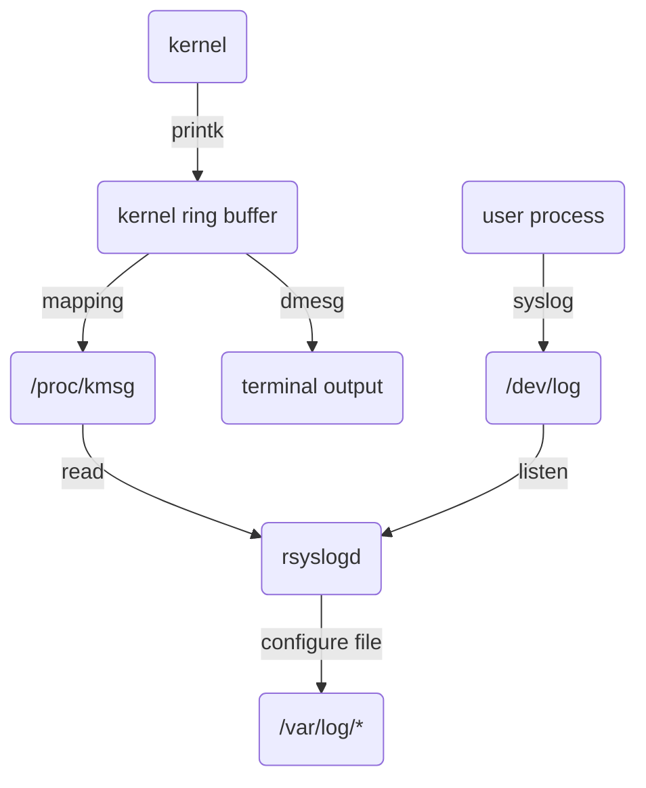

一些规范如下
- 服务器程序后台进程形式运行，父进程为1 init进程。
- 输出日志。
- 专有账户运行。
- 可配置，有配置文件。
- 启动生成配置文件放入/var/run目录，用以记录该进程的PID。
- 考虑系统资源和限制来预测承受负荷，如进程可用文件描述符总数和内存总量等。
## 7.1 日志
Linux提供守护进程rsyslogd来处理系统日志。rsyslogd能够接收用户进程输出日志和内核日志。
对于用户进程日志和内核日志：

默认情况下，调试信息存在/var/log/debug，普通信息存在/var/log/messages文件，内核信息存在/var/log/kern.log。可以在/etc/rsyslogd.conf中配置。
用户使用syslog函数与rsyslog守护进程通信。
```cpp
#include <syslog.h>
void syslog(int priority, const char* msg, ...);
//...表示可变参数
//priority对应不同的日志级别
#define LOG_EMERG 0 /* system is unusable */
#define LOG_ALERT 1 /* action must be taken immediately */
#define LOG_CRIT 2 /* critical conditions */
#define LOG_ERR 3 /* error conditions */
#define LOG_WARNING 4 /* warning conditions */
#define LOG_NOTICE 5 /* normal but significant condition */
#define LOG_INFO 6 /* informational */
#define LOG_DEBUG 7 /* debug-level messages */


syslog(LOG_INFO, "aaa%d", 10);
openlog("main", LOG_PID|LOG_CONS, 0);
setlogmask(LOG_ERR);
closelog();
#define LOG_PID 0x01 /* log the pid with each message */
#define LOG_CONS 0x02 /* log on the console if errors in sending */
#define LOG_ODELAY 0x04 /* delay open until first syslog() (default) */
#define LOG_NDELAY 0x08 /* don't delay open */
#define LOG_NOWAIT 0x10 /* don't wait for console forks: DEPRECATED */
#define LOG_PERROR 0x20 /* log to stderr as well */
```
## 7.2 用户信息
### uid, euid, gid, egid
进程获取和设置用户的真实id和有效id
```c++
#include <sys/types.h>
#include <unistd.h>

uid_t getuid();
uid_t geteuid();
gid_t getgid();
gid_t getegid();

int setuid(uid_t uid);
int seteuid(uid_t euid);
int setgid(gid_t gid);
int setegid(gid_t egid);

```
EUID是为了方面资源访问，获得该程序有效用户的权限。例如su程序的所有者是root，并设置了set-user-id标志，表示任何普通用户运行su程序时，有效用户都是root，都可以访问一些普通用户无法访问的资源。有效用户为root的进程称为特权进程。
### 切换用户
以root身份启动，切换普通身份用户运行。
```c++
static bool switch_to_user(uid_t user_id, gid_t gp_id){
	// check target user is not root
	if((user_id == 0) && (gp_id == 0)){
		return false;
	}
	//check currrent user is legal: root or target user
	uid_t uid = getuid();
	gid_t gid = getgid();
	if( ((gid!=0)||(uid!= 0)) && ((gid != gp_id) || (uid != user_id)) ) {
		return false;
	}
	if(uid != 0){
		return true;
	}
	if( (setgid(gp_id) < 0 ) || (setuid(user_id) < 0)){
		return false;
	}
	return true;
}
```
## 7.3 进程间关系
进程属于进程组，拥有进程组id，PGID。
```c++
#include<unistd.h>
pid_t getpgid(pid_t pid);
int setpgid(pid_t pid, pid_t pgid);

```
执行`ps -o pid,ppid,pgid,dis,comm | less` 查看less命令之间进程、进程组、会话之间的关系。
## 7.4 系统资源限制
```c++
#include <sys/resource.h>
struct rlimit
{
	rlimit_t rlim_cur;
	rlimit_t rlim_max;
};

int getrlimit(int resource, struct rlimit *rlimit);

int setrlimit(int recource, const struct rlimit* rlim);
```
主要的资源限制类型有：进程虚拟内存总量，核心转储文件（core）大小限制，cpu时间，数据段限制，文件大小限制，文件描述符限制，创建进程数限制，挂起信号数量限制，栈内存限制等。
## 7.5 改变工作目录和根目录
```c++
#include  <unistd.h>

char* getcwd(char* buf, size_t size); // absolute path

int chdir(const char* path);

int chroot(const cahr* path);//改变进程根目录，无法访问之前的文件（除了已经打开的文件描述符）

```


## 7.6 服务器程序后台化
int daemon(int nochdir, int noclose);

1． daemon()函数主要用于希望脱离控制台，以守护进程形式在后台运行的程序。

2． 当nochdir为0时，daemon将更改进程的根目录为root(“/”)。

3． 当noclose为0是，daemon将进城的STDIN, STDOUT, STDERR都重定向到/dev/null。

daemon的实现大致如下：

```cpp
int daemon( int nochdir,  int noclose )  
{  
   pid_t pid;  
   if ( !nochdir && chdir("/") != 0 ) //如果nochdir=0,那么改变到"/"根目录  
       return -1;  
     
   if ( !noclose ) //如果没有noclose标志  
   {  
        int fd = open("/dev/null", O_RDWR);   
        if ( fd  <  0 )  
            return -1;
       /* 重定向标准输入、输出、错误 到/dev/null，键盘的输入将对进程无任何影响，
       进程的输出也不会输出到终端*/
		dup(fd, 0);//dup函数创建一个新的文件描述符，指向相同的文件、管道和网络连接
		dup(fd, 1);
		dup(fd, 2);     
		close(fd);
	}  
  
   pid = fork();  //创建子进程.  
   if (pid  <  0)  //失败  
      return -1;  
   if (pid > 0)  
       exit(0); //返回执行的是父进程,那么父进程退出,让子进程变成真正的孤儿进程.  
    //创建的 daemon子进程执行到这里了  
   if ( setsid()  < 0 )   //创建新的会话，并使得子进程成为新会话的领头进程  
      return -1;  
   return 0;  //成功创建daemon子进程  
}
```

使用实例：
```cpp
int main()
{
    daemon(0, 0)； //参数根据需求确定
    /*  在这里添加你需要在后台做的工作代码  */

}
```
如何杀死这样的进程：通过ps+grep找到对应的后台进程，使用kill命令将进程杀死；也可创建shell脚本对进程的启动、关闭、重启进行自动管理。

